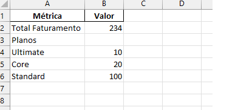
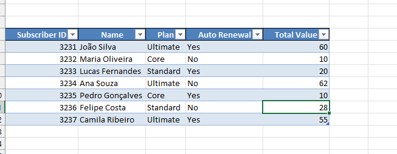
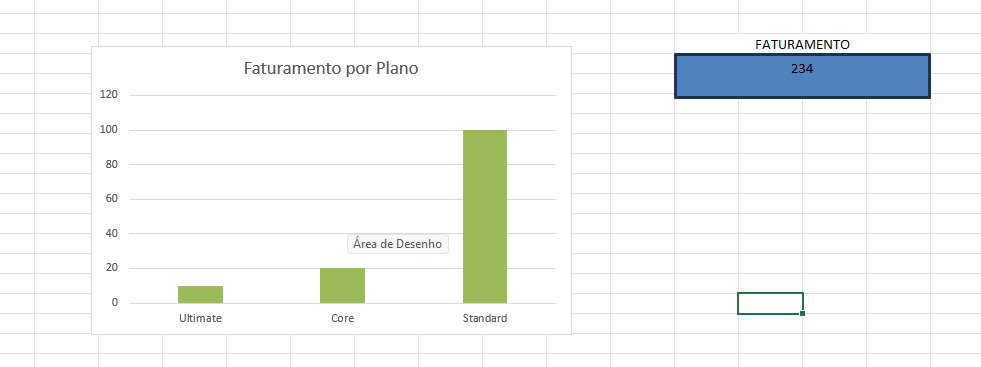

# RELATÓRIO DE IMPLEMENTAÇÃO DE SERVIÇOS AWS

**Data:** 24 de Janeiro de 2026
**Empresa:** Abstergo Industries
**Responsável:** Francisco José Dos Santos

## Introdução

Este relatório apresenta o processo de implementação de ferramentas na empresa **Abstergo Industries**, realizado por **Francisco**. O objetivo do projeto foi elencar 3 serviços AWS, com a finalidade de realizar diminuição de custos imediatos e otimização de infraestrutura.

## Descrição do Projeto

O projeto de implementação de ferramentas foi dividido em 3 etapas, cada uma com seus objetivos específicos. A seguir, serão descritas as etapas do projeto:

**Etapa 1:** - **Amazon EC2 Auto Scaling**

* **Foco da ferramenta:** Otimização de recursos e escalabilidade automática.
* **Descrição de caso de uso:** Implementação de políticas de escalonamento para as APIs de delivery. O serviço ajusta a quantidade de instâncias ligadas de acordo com a demanda (ex: picos entre 11h e 14h), garantindo que a empresa não pague por servidores ociosos durante a madrugada ou períodos de baixo tráfego.

**Etapa 2:** - **Amazon S3 (Simple Storage Service)**

* **Foco da ferramenta:** Armazenamento de objetos de baixo custo e alta durabilidade.
* **Descrição de caso de uso:** Migração de backups e arquivos estáticos (como as imagens do Dashboard Xbox) para buckets S3. Utilizando as políticas de ciclo de vida (Lifecycle Policies), os arquivos antigos são movidos automaticamente para classes de armazenamento mais baratas, como o **S3 Glacier**, reduzindo custos de armazenamento em até 70%.

**Etapa 3:** - **AWS Lambda**

* **Foco da ferramenta:** Computação Serverless (sem servidor).
* **Descrição de caso de uso:** Substituição de servidores ligados 24/7 por funções Lambda para processamento de tarefas específicas (como o cálculo de faturamento de **234** das assinaturas). Por ser um modelo *pay-per-use*, a Abstergo Industries só paga quando o código é executado, eliminando totalmente o custo de instâncias ociosas.

## Conclusão

A implementação de ferramentas na empresa **Abstergo Industries** tem como esperado a **redução drástica no desperdício de recursos computacionais e a automação do gerenciamento de dados**, o que aumentará a eficiência e a produtividade da empresa. Recomenda-se a continuidade da utilização das ferramentas implementadas e a busca por instâncias *Spot* e planos de economia (*Savings Plans*) para melhorar ainda mais a saúde financeira da infraestrutura.

## Anexos

1. **Dashboard de Vendas Xbox (Excel):** Planilha contendo a análise de faturamento real de 234.
2. **Repositório GitHub:** https://github.com/FranciscoDevfuture/Dashboard_vendas_Xbox
3. **Captura de Tela:** Imagem do dashboard integrado ao README do projeto.

## Anexos

1. **Dashboard de Vendas Xbox:** Imagem do painel de controle desenvolvido no Excel.

3. **Planilha de Dados:** Arquivo `Dashboard_Vendas_Xbox.xlsx` disponível na raiz deste repositório.

**Assinatura do Responsável pelo Projeto:**

---

**Francisco José Dos Santos**

---

